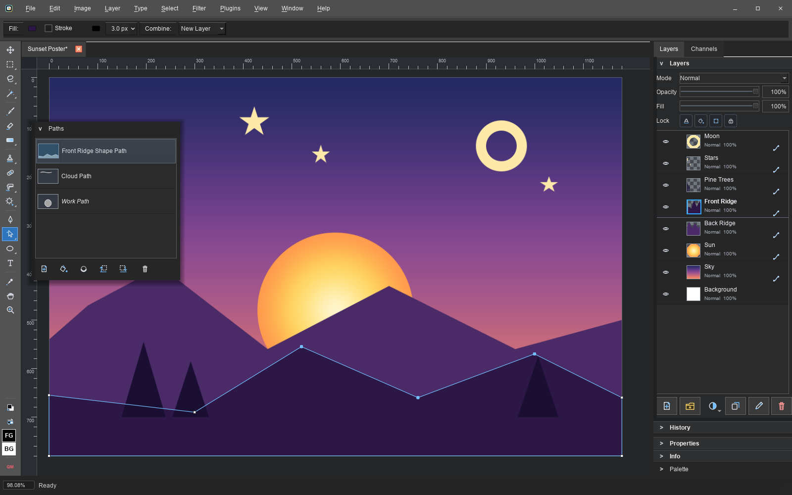
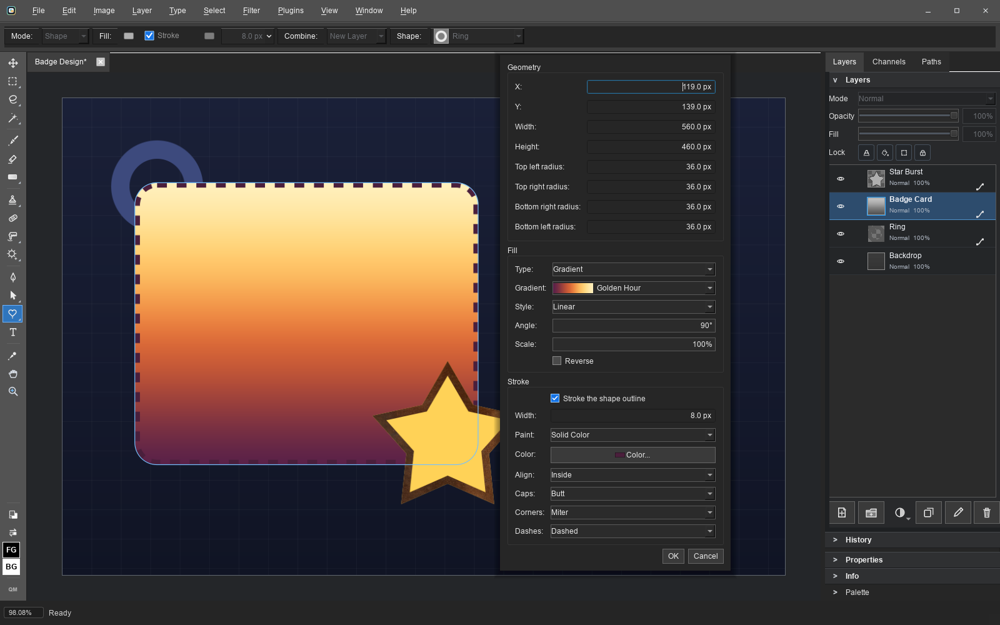
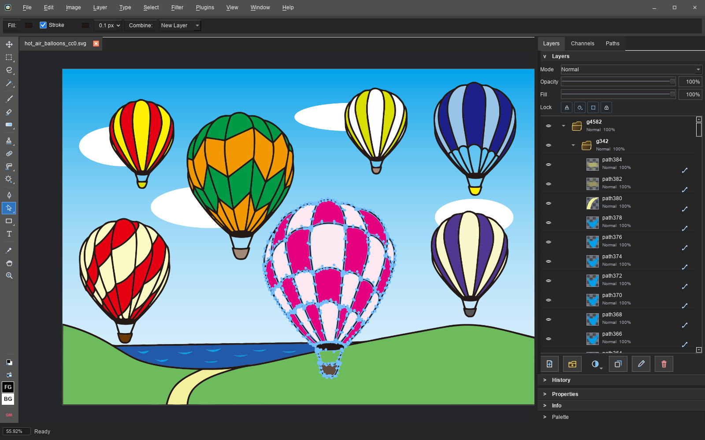

# Patchy

Open source free image editing.

Think classic Adobe Photoshop CS-style layer editing, modernized: PSD layers, masks, text, blend modes, layer styles, legacy plugins, and current formats like WebP, without subscriptions or telemetry.

## Screenshots

Click a thumbnail for the full-size image.

<table>
  <tr>
    <td align="center" valign="top" width="33%">
      <a href="docs/images/screenshots/levels.png"></a>
      <br><sub>Non-destructive adjustment layers with live preview and editable settings</sub>
    </td>
    <td align="center" valign="top" width="33%">
      <a href="docs/images/screenshots/layer_styles.png"></a>
      <br><sub>Layer styles with multiple effects, blending controls, and Photoshop-compatible presets</sub>
    </td>
    <td align="center" valign="top" width="33%">
      <a href="docs/images/screenshots/brush_tips.png"></a>
      <br><sub>Brush tip presets, import, management, spacing, angle, roundness, and texture controls</sub>
    </td>
  </tr>
  <tr>
    <td align="center" valign="top" width="33%">
      <a href="docs/images/screenshots/brush_dynamics.png"></a>
      <br><sub>Pressure-aware brush dynamics for size, opacity, flow, angle, scatter, and color</sub>
    </td>
    <td align="center" valign="top" width="33%">
      <a href="docs/images/screenshots/palette_mode.png"></a>
      <br><sub>Palette mode constrains painting and editing to a document color set</sub>
    </td>
    <td align="center" valign="top" width="33%">
      <a href="docs/images/screenshots/hue_saturation.png"></a>
      <br><sub>Live color adjustments, including targeted Hue/Saturation ranges</sub>
    </td>
  </tr>
  <tr>
    <td align="center" valign="top" width="33%">
      <a href="docs/images/screenshots/warp_text.png"></a>
      <br><sub>Warp Text with live preview: all 15 Photoshop warp styles on editable rich text</sub>
    </td>
    <td align="center" valign="top" width="33%">
      <a href="docs/images/screenshots/tile_preview.png"></a>
      <br><sub>Seamless tiling mode for game textures: paint on the canvas and strokes wrap live across every tile</sub>
    </td>
    <td align="center" valign="top" width="33%">
      <a href="docs/images/screenshots/smart_objects.png"></a>
      <br><sub>Smart Objects: Warp Transform bends them non-destructively, Edit Contents opens the embedded file in its own tab</sub>
    </td>
  </tr>
  <tr>
    <td align="center" valign="top" width="33%">
      <a href="docs/images/screenshots/pattern_manager.png"></a>
      <br><sub>Photo textures in the Pattern Manager, with full-resolution preview, import, organization, and editing</sub>
    </td>
    <td align="center" valign="top" width="33%">
      <a href="docs/images/screenshots/smart_filters.png"></a>
      <br><sub>Editable native Smart Filters with one paintable shared mask and per-filter controls</sub>
    </td>
    <td align="center" valign="top" width="33%">
      <a href="docs/images/screenshots/camera_raw.png"></a>
      <br><sub>16-bit Camera Raw development with white balance, tone, color, demosaic, and denoise controls</sub>
    </td>
  </tr>
  <tr>
    <td align="center" valign="top" width="33%">
      <a href="docs/images/screenshots/tilt_shift.png"></a>
      <br><sub>Tilt-Shift Blur with live on-image focus, angle, and transition controls</sub>
    </td>
    <td align="center" valign="top" width="33%">
      <a href="docs/images/screenshots/material_styles.png"></a>
      <br><sub>Material layer styles backed by bundled CC0 wood, stone, metal, fabric, and ground textures</sub>
    </td>
    <td align="center" valign="top" width="33%">
      <a href="docs/images/screenshots/quick_mask.png"></a>
      <br><sub>Quick Mask turns a selection into a brush-editable red overlay, then back into marching ants</sub>
    </td>
  </tr>
  <tr>
    <td align="center" valign="top" width="33%">
      <a href="docs/images/screenshots/vector_tools.png"></a>
      <br><sub>Vector shape layers: gradient fills, pen paths, anchor editing, and the Paths panel</sub>
    </td>
    <td align="center" valign="top" width="33%">
      <a href="docs/images/screenshots/shape_appearance.png"></a>
      <br><sub>Shape fills and strokes: solid, gradient, or pattern paint, dashes, and live corner radii</sub>
    </td>
    <td align="center" valign="top" width="33%">
      <a href="docs/images/screenshots/svg_import.png"></a>
      <br><sub>SVG files open as editable shape layers: groups become folders, paths stay live vectors</sub>
    </td>
  </tr>
</table>

## Video

<a href="https://www.youtube.com/watch?v=DSbMqp2cXig"></a>

The announcement video (recorded around 0.9, so it predates a lot of the features above). More videos land on [Seth's YouTube channel](https://www.youtube.com/@RobinsonTechnologies).

## Download

Windows releases are code signed by Seth A. Robinson; the macOS app is signed and
notarized (Robinson Technologies Corporation).

| Platform                  | Package                     | Download                                                                                      |
| ------------------------- | --------------------------- | --------------------------------------------------------------------------------------------- |
| Windows 10/11 (64-bit)    | Installer                   | [PatchyWindowsInstaller.exe](https://rtsoft.com/files/PatchyWindowsInstaller.exe) (28 MB)     |
| Windows 10/11 (64-bit)    | Portable ZIP (no installer) | [PatchyWindowsNoInstaller.zip](https://rtsoft.com/files/PatchyWindowsNoInstaller.zip) (28 MB) |
| macOS 12+ (Apple Silicon) | DMG - drag to Applications  | [PatchyMacOS.dmg](https://rtsoft.com/files/PatchyMacOS.dmg) (41 MB)                           |
| Linux                     | Flatpak bundle              | [PatchyLinux.flatpak](https://rtsoft.com/files/PatchyLinux.flatpak) (14 MB)                   |

Linux one-line install (paste into a terminal; fetches the bundle and installs it,
pulling the shared KDE runtime from Flathub automatically):

```sh
curl -L -o /tmp/PatchyLinux.flatpak https://rtsoft.com/files/PatchyLinux.flatpak && flatpak install -y /tmp/PatchyLinux.flatpak
```

Optional: opening iPhone HEIC photos on Linux uses the shared Freedesktop codec
extension, which bundle installs do not fetch on their own. Patchy will show this
command if it is needed:

```sh
flatpak install -y flathub org.freedesktop.Platform.ffmpeg-full//24.08
```

## Features

- Open and save layered PSD and PSB files with groups, masks, clipping masks, saved alpha and spot channels, text objects, Fill Opacity, the full Photoshop blend mode set, layer styles and more
- Common raster editing tools, including Brush with Flow and timed Airbrush buildup, Healing Brush, Clone Stamp, Dodge, Burn, Sponge, Blur, Sharpen, Smudge, Eraser, selections, transforms, gradients, and shapes
- Vector tools: Pen paths, editable shape layers (Rectangle, Ellipse, Line, Polygon, Custom Shape) with solid, gradient, or pattern fills and strokes, vector masks, path selection and anchor editing, and a Paths panel with fill, stroke, and make-selection commands, all round-tripping through PSD files that open correctly in Photoshop
- Non-destructive adjustment layers (Levels, Curves, Hue/Saturation, Color Balance, Brightness/Contrast, Invert, Posterize, Threshold) with live preview, editable settings, and native Photoshop PSD data
- Smart Objects: place or convert layers to embedded or linked smart objects, edit or replace their contents, transform them non-destructively, and build editable native Smart Filter stacks (13 filter types) with paintable shared masks and per-filter blending
- Filter Gallery with 32 effects, live full-resolution preview, ordered effect stacks, favorites, and reusable Saved Looks, plus a manual Liquify workspace with warp, twirl, pucker, bloat, and freeze brushes
- Photoshop-compatible layer style, pattern, and gradient preset libraries, including .asl, .pat, and .grd import/export, 39 built-in styles, and 20 bundled CC0 photo textures
- Warp Transform tool and Warp Text with all 15 Photoshop warp styles and live preview
- Multiple document interface: tabbed documents that can float in their own windows, with Photoshop-style Tile and Cascade arrangement
- Rich text with per-run color, font, size, and style, plus a searchable font picker and Character controls for leading, tracking, and horizontal or vertical glyph scaling
- Palettized (indexed color) editing mode for pixel art: paint constrained to a palette, quantize with optional dithering, built-in retro palettes (NES, C64, Game Boy, PICO-8, and more), palette files (.pal/.gpl/.hex/.act/.aco/.ase), and exact indexed PNG-8 and 2/4/8-bit BMP export. Layers, layer styles, and effects all keep working (Photoshop's indexed mode flattens and disables them)
- Pixel-art and game-dev extras: seamless texture authoring (live tile preview window, in-canvas tiling mode, seam shifting), sprite sheet export/import, image sequence export/import (numbered files become layers and back), and nearest-neighbor scaled export (2x-8x)
- Reads and writes a wide range of formats: PSD/PSB, PNG, JPEG, TIFF, WebP, BMP, TGA, GIF, PCX, Amiga IFF/LBM, Windows icons and cursors (ICO/CUR), Aseprite files, and SVG (opens as editable shape layers, exports with vectors preserved)
- Imports Affinity Photo and Designer .af documents as layered files: rasters, groups, masks, clipping, blend modes, editable text layers, vector shapes, adjustment layers, layer effects, and placed images (which become embedded Smart Objects)
- Opens camera raw files (CR2/CR3/NEF/ARW/RAF/DNG and more) through a 16-bit develop dialog, and HEIC/HEIF photos through platform codecs
- Photoshop-compatible document resolution, physical measurement units, rulers, image sizing, and printing
- Pen/stylus pressure and size dynamics, GUI scaling, scanner import (Windows and macOS), camera import (Windows), legacy .8bf plugins, and command line options
- JavaScript scripting: a built-in Script Manager (File > Scripts) with a folder tree over the bundled and user scripts, a code editor with live run status, a documented API covering documents, layers, text, selections, pixels, filters, form dialogs, file pickers, and batch processing, bundled examples ranging from CSV data merge, contact sheets, icon export, and versioned saves to glitch/duotone effects and playable Breakout and Pong (scripts can call other scripts), safe editing of bundled scripts (your saved copy overrides the original and can be reverted), and a --run-script command line flag with script arguments so external tools and AI agents can drive Patchy. See the [scripting guide](scripts/bundled/scripting-guide.md) (also under Help inside the app)
- Cross-platform: Windows is the lead platform, with native macOS (Apple Silicon) and Linux (Flatpak) builds
- Built with C++ and Qt for a native desktop experience. No GPU used, should run on a potato
- Privacy: YES! Absolutely no telemetry, no tracking, no data collection (if update checks are enabled, it contacts GitHub only to check for a newer version). Settings live in a plain local file, and the installer doesn't screw with your file extension preferences
- Localized in English and Japanese (change language in File->Preferences)

## What's New

### 0.81 - July 20, 2026

- Affinity Photo and Designer .af files now open as layered documents: raster layers (8-bit, 16-bit, grayscale, and float), groups, layer masks, clipping, opacity and blend modes, CMYK and Lab color through ICC conversion, document DPI, and the canvas background all come through, with scaled and rotated layers rendered through their transforms. Anything Patchy can't model becomes a named placeholder layer with a notice instead of failing the open
- Affinity text imports as real editable text layers with per-run fonts, sizes, and colors, alignment, paragraph spacing, All Caps, frame-box wrapping, and rotated artistic text, and Affinity layer effects (shadows, glows, strokes, color and gradient overlays, bevels) map onto Patchy layer styles
- Affinity vector curves import as shape layers with their fills and strokes, placed images become embedded Smart Objects (so Edit Contents and Replace Contents work on them), and Curves, Levels, HSL, Color Balance, Invert, Posterize, Threshold, and Brightness/Contrast adjustment layers import natively with their masks
- Five new blend modes: Vivid Light, Linear Light, Hard Mix, Darker Color, and Lighter Color, all calibrated bit-exact against Photoshop 2026, and Color Burn and Color Dodge rounding now matches Photoshop exactly
- File > Import > Image Sequence to Layers and File > Export Layers as Image Sequence: files order naturally (frame2 before frame10), picking one numbered file pulls in its whole run, and export covers visible or all layers with numbered or layer-name file names
- Seamless texture tools: the tile preview now follows the active document and refreshes live, Image > Shift Seams to Center wraps the image so the seams sit in the middle for retouching (running it again shifts back exactly), and View > Seamless Tiling in Window surrounds the canvas with live ghost tiles
- Smart Filter rows open their settings on double-click with blend mode and opacity merged into the same dialog, and Filter Gallery entries gain per-effect blend and opacity controls
- The Open dialog now lists one row per file format, Photoshop style, so every supported type is visible in the dropdown
- The Character panel grays out with a hint when no text is being edited, Alt+click on a folder's arrow expands or collapses the whole branch, the layer panel's selection highlight and thumbnails render correctly, and options-bar number fields no longer clip wide values
- The startup splash is gone: Patchy opens straight into the start panel, which now carries the version, links, and update check. Save PDF suggests the document's name, and patchy.exe gains an unattended --export flag for converting files from the command line

### 0.80 - July 18, 2026

- Vector tools are here: the Rectangle, Ellipse, Line, Polygon, and Custom Shape tools draw editable shape layers, the Pen builds bezier paths point by point with cursor badges that show what each click will do, and the Path Select and Direct Select tools move whole shapes or individual anchors with live re-rendering. Shape layers, vector masks, and saved paths round-trip through PSD and PSB files that open correctly in Photoshop
- Shapes carry a full appearance: no fill, solid color, gradient, or pattern fills and strokes, with stroke width, inside/center/outside alignment, caps, joins, and dashes. Edit them from the options bar's new Fill and Stroke paint pickers or the Shape Appearance dialog, where live rectangles, ellipses, and lines can also be re-edited numerically (bounds, per-corner radii, endpoints, weight). Layer > New Fill Layer creates solid, gradient, and pattern fill layers that can clip to a path
- A Photoshop-style Paths panel manages saved paths and the work path: fill a path with color or a pattern, stroke it through the real brush engine with an optional pressure taper, convert paths to selections and selections to work paths, free-transform a path or just its selected anchors with Ctrl+T, drag rows to reorder, and mark a saved path as the print clipping path
- SVG files open as editable shape layers: live shapes, groups as folders, gradients, stylesheet classes, clip paths, simple patterns, embedded images, and basic text all survive (files past the supported subset fall back to a flattened raster import, and .svgz works too). Save As and Export write SVG back out with shape layers kept as real vectors. You can also paste SVG from the clipboard as shapes, place an SVG as an embedded smart object, and turn an SVG file into a stampable custom shape
- New Liquify workspace (Filter > Liquify) with Warp, Reconstruct, Smooth, Twirl, Pucker, Bloat, Freeze, and Thaw brushes over a live preview
- New Lens Blur (aperture blade count, curvature, and rotation) and Iris Blur (elliptical focus region) filters, plus Add Noise with uniform or Gaussian distribution, bringing the Filter Gallery to 32 effects
- Emboss, Box Blur, Radial Blur, Add Noise, and Mosaic now work as editable native Smart Filters, bringing the roster to 13 filter types. The Filter Gallery marks which effects can apply as Smart Filters on the current layer, and Photoshop now opens Patchy-authored Smart Filter files correctly
- Four new adjustment layers: Brightness/Contrast, Invert, Posterize, and Threshold, all reading and writing native Photoshop PSD data. Color Balance adjustment layers now save natively too, so Photoshop no longer opens them as flat white layers
- Redesigned New Document dialog with a preset card grid, and Patchy now starts with a clean workspace instead of an empty untitled document
- The tool palette is reorganized into clusters with new Stamp and Gradient/Fill flyouts, options-bar number fields gained slider popups with common values, and document tabs offer Reopen, Reveal in Explorer/Finder, and Copy File Path

[Older releases](RELEASE-HISTORY.md)

## Building it yourself

Build the dependency-light core and tests without the Qt app:

```sh
cmake --preset dev -DPATCHY_BUILD_APP=OFF
cmake --build --preset dev
ctest --preset dev
```

Build the Qt desktop app:

```sh
cmake --preset qt-local
cmake --build --preset qt-local
```

The local Qt app preset writes `patchy.exe` under `build/app`.

Run the standard local test script:

```powershell
powershell -ExecutionPolicy Bypass -File scripts/run-tests.ps1
```

### macOS and Linux

Install Qt 6.8.3 into `.deps/Qt` (for example `pip install aqtinstall && aqt install-qt
mac desktop 6.8.3 -m qtimageformats -O .deps/Qt`, or `linux desktop 6.8.3 linux_gcc_64`
on Linux), then build the matching preset:

```sh
cmake --preset mac-release      # or linux-release
cmake --build --preset mac-release
```

macOS produces `build/mac-release/Patchy.app`; Linux produces
`build/linux-release/patchy`. `packaging/macos/make-dmg.sh` and
`packaging/linux/make-flatpak.sh` create the distributable artifacts. Both test suites
run offscreen on all three platforms (`QT_QPA_PLATFORM=offscreen`).

## Windows Release Package

Create local Windows release artifacts:

```bat
build-release.bat
```

The script configures and builds the `release` preset, signs `build\release\patchy.exe`, the installer helper executables, and the installer when the local signing environment is available, deploys the minimum Qt runtime needed by the current app, copies third-party notices, and creates:

```text
build\package\PatchyWindowsNoInstaller.zip
build\package\PatchyWindowsInstaller.exe
```

The zip contains a top-level `Patchy` folder so it can be dragged anywhere and does not include installer-only helpers. The installer is a local per-user installer that installs to `%LOCALAPPDATA%\Programs\Patchy`, creates a Start Menu shortcut, offers a desktop shortcut, and registers an uninstall entry.  `latest_version.json` is the update metadata file.

## Current Status

Patchy is not Photoshop-compatible across the full PSD surface yet, but a round-trip from/to Photoshop mostly works with RGB/RGBA 8-bit documents that use basic pixel layers, text objects, groups, masks, blend modes, layer styles, and the currently supported adjustment layers.

Important Photoshop features that are not supported yet, or are only partially supported:

- Editable Smart Filters cover 13 filter types with paintable shared masks and per-filter opacity and blend modes; unsupported imported filter types (including the Blur Gallery and Liquify smart filters) remain preview-locked and byte-preserved
- Full Photoshop adjustment-layer compatibility beyond Patchy's current adjustment support
- CMYK/Lab editing and export, editable spot separations and RGB component channels, multi-channel overlays, 16/32-bit editing, HDR/EXR, and full color-management parity (Patchy converts CMYK/Lab to RGB on open, but does not edit or save in those color modes)
- Layer comps, timeline/video/animation workflows, content-aware tools, and generative tools
- Actions, batch processing, scripting, UXP/JSX panels, and other automation workflows
- High-fidelity PSD/PSB edge cases, including layered PSB writing and byte-perfect preservation of every Photoshop-only metadata block
- Not tested much yet; expect bugs
- Patchy is slower than Photoshop, especially on large documents and it doesn't support GPU acceleration at all.  However, being CPU only helps with porting and stability so kind of a trade-off that makes sense, for now.  That said, certain operations have been optimized for multicore - canvas compositing and image flattening are multithreaded, splitting large images (4 Mpx+) into strips rendered on all CPU cores.


## License

Patchy is released under the MIT License. Third-party runtime notices are tracked in `NOTICE-THIRD-PARTY.md`.

## Trademark Notice

Adobe and Photoshop are either registered trademarks or trademarks of Adobe in the United States and/or other countries. Patchy is an independent project and is not authorized, endorsed, or sponsored by Adobe. References to Photoshop and its file formats (PSD, Smart Objects, Smart Filters) are only there to describe compatibility.

## AI Disclosure

This project was developed with significant assistance from AI tools.  I mean, you can still blame me (Seth) for bugs, but I just wanted to mention it.

Note:  All included textures/materials are real images taken by humans, not AI generated

## Missing features?

AI has reached the point where you can use your favorite AI to add the missing feature you want.

Just give it the link to this repo and say "Add .tiff support" and in about 10 minutes it will be done and working on your computer.  Amazing, right?

I mean, that's kind of the power of open source.

Whatever AI you use, tell it (or more likely, it's reading this right now) to read AGENTS.md first at all times before doing anything else - that's where the build commands, conventions, and project knowledge live. 

Notice that there are 1000+ regression and benchmarking tests, AGENTS.md will teach your AI how to use these to insure it doesn't screw stuff up.\
\
If you have a bug fix or feature you think should be in this repo, please look at the actual code and fully TEST IT YOURSELF before submitting the PR.  If you're using AI, use a good one (Fable+ class), we don't want barely working slop.\
\
I probably don't want any major features coming from outside, as there are wrong and right ways to do things, some of it a bit subjective. Remember, you can always go crazy in your own fork, have some fun!\
\
Don't trust AI to create and submit PRs with no oversight, I'll delete ones that have too much AI smell.  Smell human.  This is starting to sound weird but you know what I mean.\
\
Also, note that certain features are crippled or not included due to Adobe patents.  For example, our "quick select" tool doesn't update in realtime, you have to finish the stroke.  We can revisit this around 2030 when the patents expire...

## Credits

Created by Seth A. Robinson - [Homepage](https://www.rtsoft.com/) | [Blog](https://www.codedojo.com/) | [Twitter](https://twitter.com/rtsoft) | [Bluesky](https://bsky.app/profile/rtsoft.com) | [Mastodon](https://mastodon.gamedev.place/@rtsoft)

Code contributions from [Michael Capogna](https://github.com/mcapogna)

Photo "akiko_cycling_okinawa" (seen in the screenshots) by Seth A. Robinson
