# Patchy

Open source free image editing.

Think classic Adobe Photoshop CS-style layer editing, modernized: PSD layers, masks, text, blend modes, layer styles, legacy plugins, and current formats like WebP, without subscriptions or telemetry.

## Screenshots

Click a thumbnail for the full-size image.

<table>
  <tr>
    <td align="center" valign="top" width="33%">
      <a href="docs/images/screenshots/levels.png">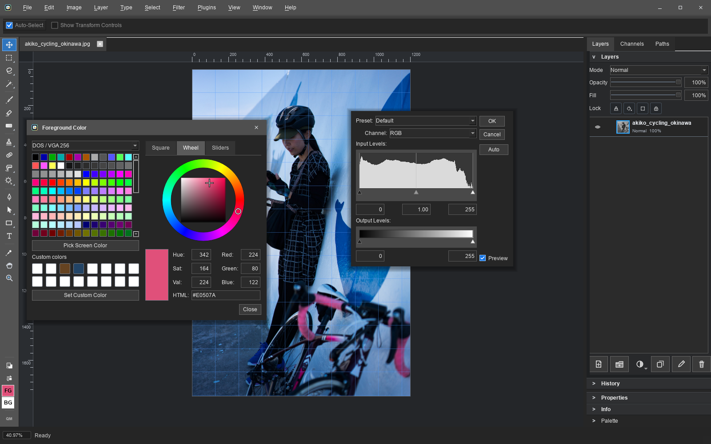</a>
      <br><sub>Non-destructive adjustment layers with live preview and editable settings</sub>
    </td>
    <td align="center" valign="top" width="33%">
      <a href="docs/images/screenshots/layer_styles.png">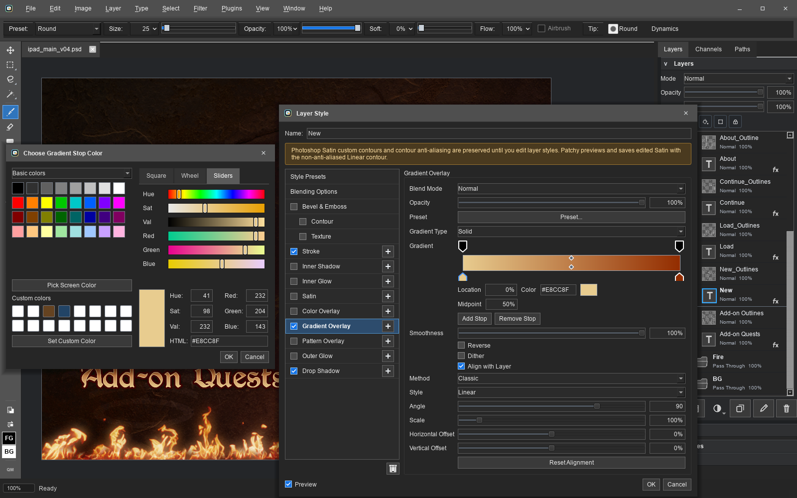</a>
      <br><sub>Layer styles with multiple effects, blending controls, and Photoshop-compatible presets</sub>
    </td>
    <td align="center" valign="top" width="33%">
      <a href="docs/images/screenshots/brush_tips.png">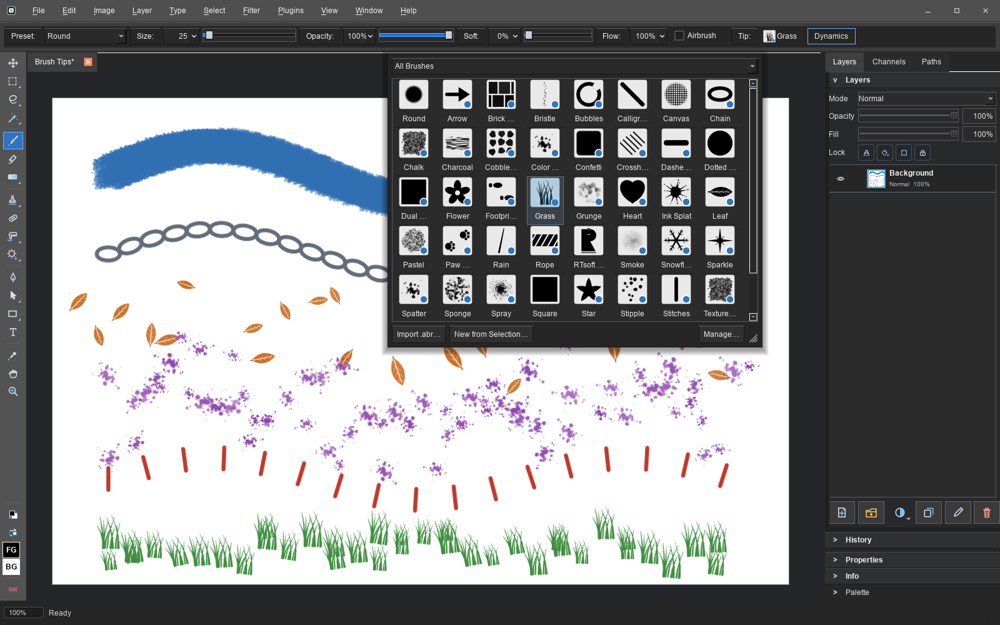</a>
      <br><sub>Brush tip presets, import, management, spacing, angle, roundness, and texture controls</sub>
    </td>
  </tr>
  <tr>
    <td align="center" valign="top" width="33%">
      <a href="docs/images/screenshots/brush_dynamics.png">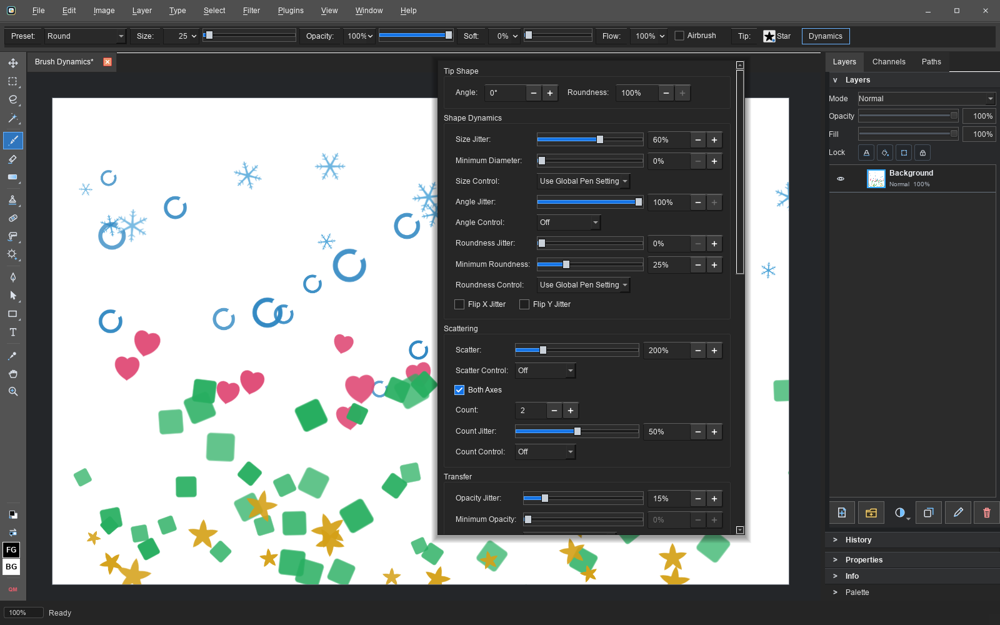</a>
      <br><sub>Pressure-aware brush dynamics for size, opacity, flow, angle, scatter, and color</sub>
    </td>
    <td align="center" valign="top" width="33%">
      <a href="docs/images/screenshots/palette_mode.png">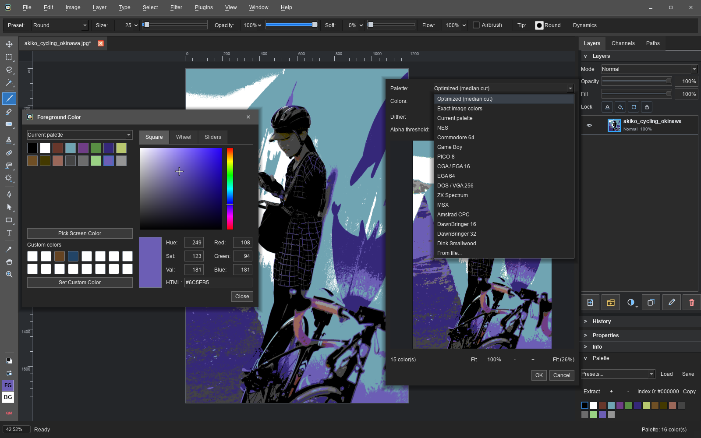</a>
      <br><sub>Palette mode constrains painting and editing to a document color set</sub>
    </td>
    <td align="center" valign="top" width="33%">
      <a href="docs/images/screenshots/hue_saturation.png">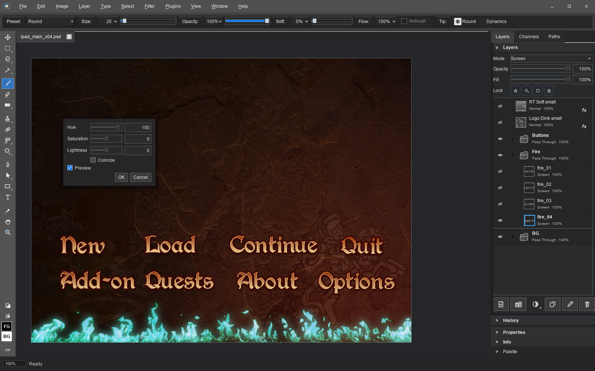</a>
      <br><sub>Live color adjustments, including targeted Hue/Saturation ranges</sub>
    </td>
  </tr>
  <tr>
    <td align="center" valign="top" width="33%">
      <a href="docs/images/screenshots/warp_text.png">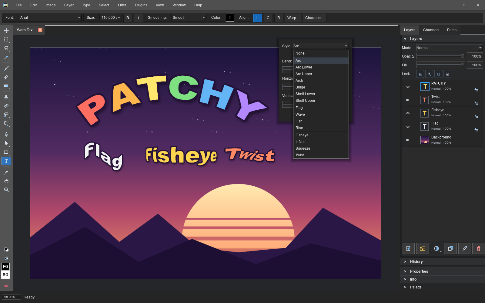</a>
      <br><sub>Warp Text with live preview: all 15 Photoshop warp styles on editable rich text</sub>
    </td>
    <td align="center" valign="top" width="33%">
      <a href="docs/images/screenshots/tile_preview.png">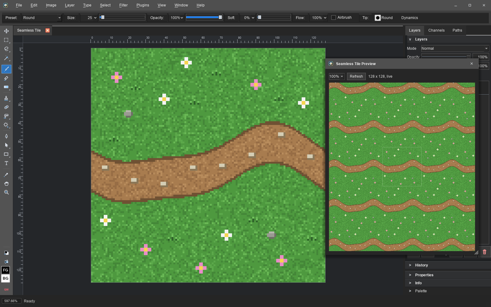</a>
      <br><sub>Seamless Tile Preview for game textures: the tiled view updates live as you paint</sub>
    </td>
    <td align="center" valign="top" width="33%">
      <a href="docs/images/screenshots/smart_objects.png">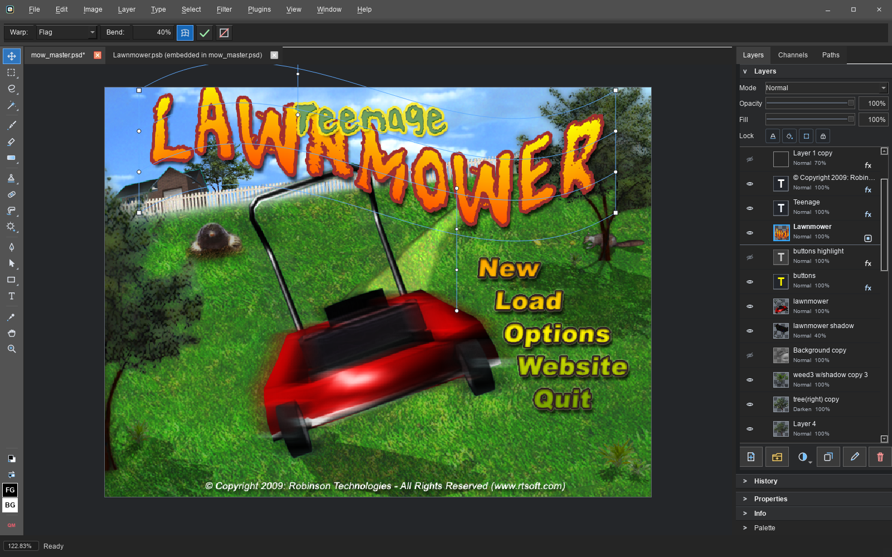</a>
      <br><sub>Smart Objects: Warp Transform bends them non-destructively, Edit Contents opens the embedded file in its own tab</sub>
    </td>
  </tr>
  <tr>
    <td align="center" valign="top" width="33%">
      <a href="docs/images/screenshots/pattern_manager.png">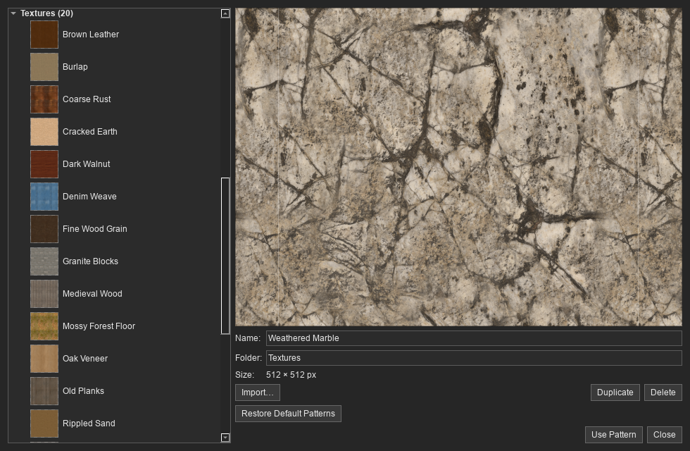</a>
      <br><sub>Photo textures in the Pattern Manager, with full-resolution preview, import, organization, and editing</sub>
    </td>
    <td align="center" valign="top" width="33%">
      <a href="docs/images/screenshots/smart_filters.png">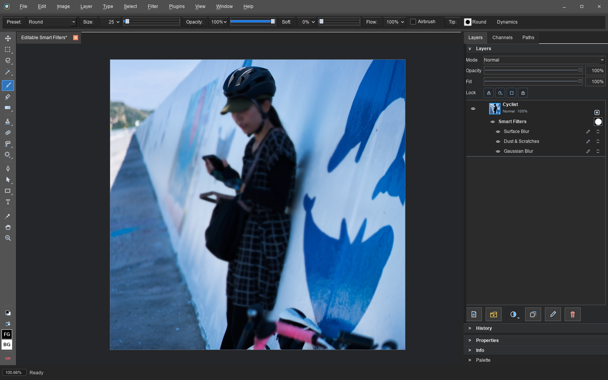</a>
      <br><sub>Editable native Smart Filters with one paintable shared mask and per-filter controls</sub>
    </td>
    <td align="center" valign="top" width="33%">
      <a href="docs/images/screenshots/camera_raw.png">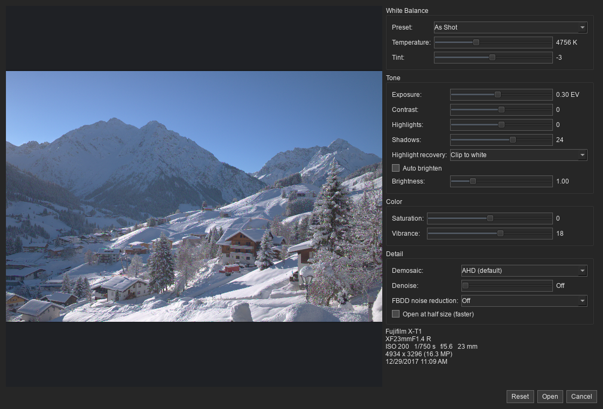</a>
      <br><sub>16-bit Camera Raw development with white balance, tone, color, demosaic, and denoise controls</sub>
    </td>
  </tr>
  <tr>
    <td align="center" valign="top" width="33%">
      <a href="docs/images/screenshots/tilt_shift.png">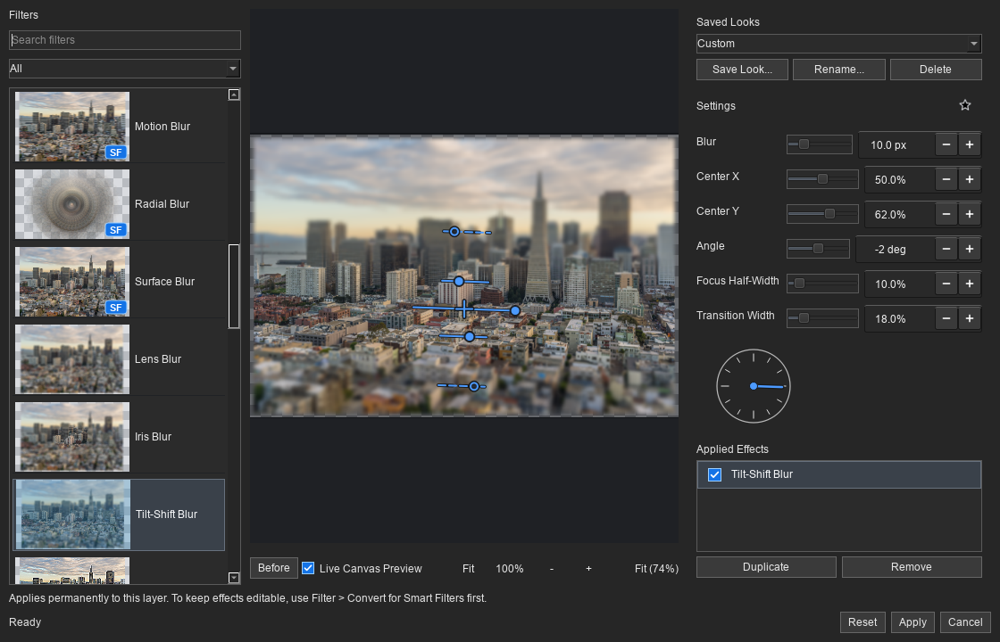</a>
      <br><sub>Tilt-Shift Blur with live on-image focus, angle, and transition controls</sub>
    </td>
    <td align="center" valign="top" width="33%">
      <a href="docs/images/screenshots/material_styles.png">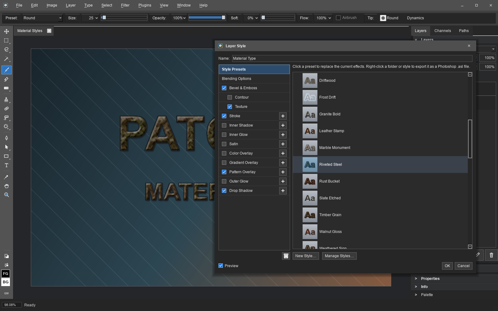</a>
      <br><sub>Material layer styles backed by bundled CC0 wood, stone, metal, fabric, and ground textures</sub>
    </td>
    <td align="center" valign="top" width="33%">
      <a href="docs/images/screenshots/quick_mask.png">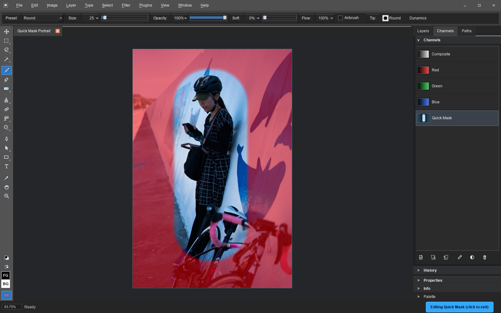</a>
      <br><sub>Quick Mask turns a selection into a brush-editable red overlay, then back into marching ants</sub>
    </td>
  </tr>
</table>

## Video

<a href="https://www.youtube.com/watch?v=DSbMqp2cXig"></a>

The announcement video (recorded around 0.9, so it predates a lot of the features above). More videos land on [Seth's YouTube channel](https://www.youtube.com/@RobinsonTechnologies).

## Download

Windows releases are code signed by Seth A. Robinson; the macOS app is signed and
notarized (Robinson Technologies Corporation).

| Platform                  | Package                     | Download                                                                                      |
| ------------------------- | --------------------------- | --------------------------------------------------------------------------------------------- |
| Windows 10/11 (64-bit)    | Installer                   | [PatchyWindowsInstaller.exe](https://rtsoft.com/files/PatchyWindowsInstaller.exe) (16 MB)     |
| Windows 10/11 (64-bit)    | Portable ZIP (no installer) | [PatchyWindowsNoInstaller.zip](https://rtsoft.com/files/PatchyWindowsNoInstaller.zip) (16 MB) |
| macOS 12+ (Apple Silicon) | DMG - drag to Applications  | [PatchyMacOS.dmg](https://rtsoft.com/files/PatchyMacOS.dmg) (27 MB)                           |
| Linux                     | Flatpak bundle              | [PatchyLinux.flatpak](https://rtsoft.com/files/PatchyLinux.flatpak) (2 MB)                    |

Linux one-line install (paste into a terminal; fetches the bundle and installs it,
pulling the shared KDE runtime from Flathub automatically):

```sh
curl -L -o /tmp/PatchyLinux.flatpak https://rtsoft.com/files/PatchyLinux.flatpak && flatpak install -y /tmp/PatchyLinux.flatpak
```

Optional: opening iPhone HEIC photos on Linux uses the shared Freedesktop codec
extension, which bundle installs do not fetch on their own. Patchy will show this
command if it is needed:

```sh
flatpak install -y flathub org.freedesktop.Platform.ffmpeg-full//24.08
```

## Features

- Open and save layered PSD and PSB files with groups, masks, clipping masks, saved alpha and spot channels, text objects, Fill Opacity, the full Photoshop blend mode set, layer styles and more
- Common raster editing tools, including Brush with Flow and timed Airbrush buildup, Healing Brush, Clone Stamp, Dodge, Burn, Sponge, Blur, Sharpen, Smudge, Eraser, selections, transforms, gradients, and shapes
- Smart Objects: place or convert layers to embedded or linked smart objects, edit or replace their contents, transform them non-destructively, and build editable native Smart Filter stacks with paintable shared masks and per-filter blending
- Filter Gallery with 31 effects, live full-resolution preview, ordered effect stacks, favorites, and reusable Saved Looks
- Photoshop-compatible layer style, pattern, and gradient preset libraries, including .asl, .pat, and .grd import/export, 39 built-in styles, and 20 bundled CC0 photo textures
- Warp Transform tool and Warp Text with all 15 Photoshop warp styles and live preview
- Multiple document interface: tabbed documents that can float in their own windows, with Photoshop-style Tile and Cascade arrangement
- Rich text with per-run color, font, size, and style, plus a searchable font picker and Character controls for leading, tracking, and horizontal or vertical glyph scaling
- Palettized (indexed color) editing mode for pixel art: paint constrained to a palette, quantize with optional dithering, built-in retro palettes (NES, C64, Game Boy, PICO-8, and more), palette files (.pal/.gpl/.hex/.act/.aco/.ase), and exact indexed PNG-8 and 2/4/8-bit BMP export. Layers, layer styles, and effects all keep working (Photoshop's indexed mode flattens and disables them)
- Pixel-art and game-dev extras: seamless tile preview window, sprite sheet export/import, and nearest-neighbor scaled export (2x-8x)
- Reads and writes a wide range of formats: PSD/PSB, PNG, JPEG, TIFF, WebP, BMP, TGA, GIF, PCX, Amiga IFF/LBM, Windows icons and cursors (ICO/CUR), and Aseprite files
- Opens camera raw files (CR2/CR3/NEF/ARW/RAF/DNG and more) through a 16-bit develop dialog, and HEIC/HEIF photos through platform codecs
- Photoshop-compatible document resolution, physical measurement units, rulers, image sizing, and printing
- Pen/stylus pressure and size dynamics, GUI scaling, scanner import (Windows and macOS), camera import (Windows), legacy .8bf plugins, and command line options
- Cross-platform: Windows is the lead platform, with native macOS (Apple Silicon) and Linux (Flatpak) builds
- Built with C++ and Qt for a native desktop experience. No GPU used, should run on a potato
- Privacy: YES! Absolutely no telemetry, no tracking, no data collection (if update checks are enabled, it contacts GitHub only to check for a newer version). Settings live in a plain local file, and the installer doesn't screw with your file extension preferences
- Localized in English and Japanese (change language in File->Preferences)

## What's New

### Unreleased

- New vector workflows bring Photoshop-compatible shape layers, pen paths, and vector masks. The Rectangle, Ellipse, Line, Polygon, and Custom Shape tools draw editable shape layers with solid, gradient, or pattern fills and full stroke controls, the Pen builds bezier paths point by point, and the Path Select and Direct Select tools move whole shapes or individual anchors with live re-rendering
- A new Paths panel manages saved paths and the work path with fill, stroke, and make-selection commands, layers can carry vector masks alongside raster masks, prebuilt custom shapes include arrows and common symbols, and shape layers, vector masks, and saved paths round-trip through PSD and PSB files that open correctly in Photoshop
- The Pen tool now shows what a click will do before you commit: cursor badges mark adding, deleting, and converting points plus closing the path, holding Ctrl temporarily switches to Direct Select for quick anchor fixes, and a status hint explains the close, commit, and cancel keys. The Path Select tools moved next to the Pen, shape layers gained an Edit Shape Appearance context-menu entry, and Define Custom Shape asks for a name

### 0.20 - July 15, 2026

- New classic Healing Brush transfers detail from an Alt-clicked source while adapting it to the destination tone. Aligned sampling, adjustable Diffusion, selections, palette mode, and ordinary PSD/PSB pixel round-trips are supported
- New Dodge, Burn, Sponge, Blur, and Sharpen brushes provide local tone, color, and detail corrections. They share Size, Softness, and Strength controls, include tonal-range and vibrance options, respect selections and palette mode, and save as ordinary Photoshop-compatible layer pixels
- Unsharp Mask and Motion Blur now work as editable native Smart Filters, with Photoshop-compatible settings, PSD descriptors, shared masks, blending, and stack controls. Their destructive Filter menu versions use the same calibrated renderers
- Brush painting now has separate Opacity and Flow controls plus timed Airbrush buildup while the pointer is held still. Flow uses fixed spatial dabs, respects the per-stroke opacity ceiling, works on grayscale mask targets, and saves as ordinary PSD/PSB pixels
- New Plastic Wrap filter adds adjustable highlight strength, detail, and smoothness. It is available destructively, in the Filter Gallery's Artistic category, and as an editable Photoshop-compatible Smart Filter in PSD files
- New Filter Gallery with 29 effects across photo looks, blur, sharpen, distort, noise, pixelate, stylize, render, and artistic categories. Search and favorites make effects easy to find, while full-resolution live preview, reorderable effect stacks, per-effect opacity and blending, and reusable Saved Looks support more involved recipes
- Smart Filters now use Photoshop-compatible native PSD data. Smart Objects can carry editable stacks of Gaussian Blur, High Pass, Median, Dust & Scratches, Surface Blur, Unsharp Mask, Motion Blur, and Plastic Wrap, with per-filter visibility and blending plus one shared paintable mask. Supported stacks survive PSD round-trips and rebuild from the original Smart Object contents after edits and transforms
- Camera raw support opens CR2, CR3, NEF, ARW, RAF, DNG, and more through a 16-bit develop dialog with white balance, exposure, highlight recovery, contrast, highlights, shadows, saturation, vibrance, demosaic, and noise-reduction controls
- HEIC and HEIF photos now open read-only through platform codecs, including orientation and color-profile handling. Windows offers Store links when a required codec is missing, while Linux explains how to install its optional Flatpak codec extension
- Layer styles gained Pattern Overlay, Satin, gradient midpoints, expanded Bevel & Emboss controls, and Photoshop-compatible pattern data. A new Styles page and Style Manager add 39 built-in presets plus .asl import/export
- Pattern and gradient libraries now support Photoshop .pat and .grd files. The Pattern Manager can also import ordinary images, while 20 bundled CC0 photo textures and 13 matching material styles provide ready-to-use wood, stone, metal, fabric, and ground surfaces
- The Filter Gallery collection adds High Pass, Median, Dust & Scratches, Surface Blur, and Tilt-Shift Blur. Tilt-Shift includes a draggable on-image focus control, while the supported classic blur and sharpen filters can be added directly to native Smart Filter stacks
- Text editing gained a searchable font picker with live type specimens and a Character panel for leading, tracking, and horizontal or vertical glyph scaling. Imported PSD text now follows Photoshop's leading, tracking, scaling, transform, and first-baseline behavior more closely
- Curves has a new point editor and .acv preset support, CMYK PSD files now use their embedded ICC profiles for pixels, text, and effect colors, and gradients gained Classic, Perceptual, and Linear interpolation with Photoshop-compatible alignment
- New Quick Mask mode lets brushes and other paint tools edit a selection through a red overlay before converting it back to marching ants
- Resolution and measurement handling now matches Photoshop more closely: image resolution is independent metadata, rulers can use pixels, inches, centimeters, millimeters, points, or percent, and Image Size, New Document, Smart Object placement, and printing share the same PPI model
- Photoshop Fill Opacity now reads, renders, edits, and writes through PSD files, including the special Fill behavior used by Color Burn, Linear Burn, Color Dodge, Linear Dodge, and Difference
- Fixed Stroke styles on masked layers, filter-stack reordering, Smart Filter conversion state, macOS scanner flow, text Bold/Italic shortcuts, gradient alignment, Blend If controls, and several session-close and revision-cache bugs

### 0.16 - July 11, 2026

- New Channels panel with editable saved alpha channels, read-only RGB component previews, selection save/load, colored overlays, and lossless PSD/PSB preservation of spot channels
- Smart Objects now round-trip through PSD and PSB files, including embedded and linked content. Place or convert layers, edit or replace contents, update or relink external files, embed linked objects, duplicate them independently, and rasterize them when needed
- New Warp Transform tool with a draggable 4x4 cage, live preview, and Photoshop-compatible style presets. Smart Objects keep the warp non-destructive, while pixel layers apply it in one undoable step
- Warp Text supports all 15 Photoshop warp styles plus horizontal and vertical distortion, with a live dialog preview and editable text preserved through Photoshop round-trips
- Documents can float in separate OS windows: drag tabs out to float them, drop windows on the tab bar to dock them, or use Window > Tile, Cascade, Float All in Windows, and Consolidate All to Tabs
- Clipping masks now render and round-trip through PSD files, with Ctrl+Alt+G, clickable row badges, and Photoshop-style Alt-click between layer rows. View Layer Mask shows a mask in grayscale and selects it for painting
- Hue/Saturation Colorize now renders, loads, and saves as a native PSD adjustment. CMYK PSD fixes restore effect and text colors, accept empty layer channels, and improve imported adjustment-layer clipping behavior
- Text edits now show apply and cancel buttons in the options bar, new text layers appear in the Layers panel as soon as editing starts, and layer badges open their matching Smart Object or Layer Style controls
- Fixed transparent Smart Object pixels turning black after PSD/PSB saves, phantom masks appearing on some files, and slow zooming or panning on very large documents

[Older releases](RELEASE-HISTORY.md)

## Building it yourself

Build the dependency-light core and tests without the Qt app:

```sh
cmake --preset dev -DPATCHY_BUILD_APP=OFF
cmake --build --preset dev
ctest --preset dev
```

Build the Qt desktop app:

```sh
cmake --preset qt-local
cmake --build --preset qt-local
```

The local Qt app preset writes `patchy.exe` under `build/app`.

Run the standard local test script:

```powershell
powershell -ExecutionPolicy Bypass -File scripts/run-tests.ps1
```

### macOS and Linux

Install Qt 6.8.3 into `.deps/Qt` (for example `pip install aqtinstall && aqt install-qt
mac desktop 6.8.3 -m qtimageformats -O .deps/Qt`, or `linux desktop 6.8.3 linux_gcc_64`
on Linux), then build the matching preset:

```sh
cmake --preset mac-release      # or linux-release
cmake --build --preset mac-release
```

macOS produces `build/mac-release/Patchy.app`; Linux produces
`build/linux-release/patchy`. `packaging/macos/make-dmg.sh` and
`packaging/linux/make-flatpak.sh` create the distributable artifacts. Both test suites
run offscreen on all three platforms (`QT_QPA_PLATFORM=offscreen`).

## Windows Release Package

Create local Windows release artifacts:

```bat
build-release.bat
```

The script configures and builds the `release` preset, signs `build\release\patchy.exe`, the installer helper executables, and the installer when the local signing environment is available, deploys the minimum Qt runtime needed by the current app, copies third-party notices, and creates:

```text
build\package\PatchyWindowsNoInstaller.zip
build\package\PatchyWindowsInstaller.exe
```

The zip contains a top-level `Patchy` folder so it can be dragged anywhere and does not include installer-only helpers. The installer is a local per-user installer that installs to `%LOCALAPPDATA%\Programs\Patchy`, creates a Start Menu shortcut, offers a desktop shortcut, and registers an uninstall entry.  `latest_version.json` is the update metadata file.

## Current Status

Patchy is not Photoshop-compatible across the full PSD surface yet, but a round-trip from/to Photoshop mostly works with RGB/RGBA 8-bit documents that use basic pixel layers, text objects, groups, masks, blend modes, layer styles, and the currently supported adjustment layers.

Important Photoshop features that are not supported yet, or are only partially supported:

- Vector/path workflows, including pen paths, editable shape layers, vector masks, and editable stroke/fill appearance
- Editable Smart Filters currently support Gaussian Blur, High Pass, Median, Dust & Scratches, Surface Blur, Unsharp Mask, Motion Blur, and Plastic Wrap stacks, paintable shared masks, and per-filter opacity and blend modes. Unsupported imported filter types (including the Blur Gallery) remain preview-locked and byte-preserved
- Full Photoshop adjustment-layer compatibility beyond Patchy's current adjustment support
- CMYK/Lab editing and export, editable spot separations and RGB component channels, multi-channel overlays, 16/32-bit editing, HDR/EXR, and full color-management parity (Patchy converts CMYK/Lab to RGB on open, but does not edit or save in those color modes)
- Layer comps, timeline/video/animation workflows, Camera Raw, Liquify, content-aware tools, and generative tools
- Actions, batch processing, scripting, UXP/JSX panels, and other automation workflows
- High-fidelity PSD/PSB edge cases, including layered PSB writing and byte-perfect preservation of every Photoshop-only metadata block
- Not tested much yet; expect bugs
- Patchy is slower than Photoshop, especially on large documents and it doesn't support GPU acceleration at all.  However, being CPU only helps with porting and stability so kind of a trade-off that makes sense, for now.  That said, certain operations have been optimized for multicore - canvas compositing and image flattening are multithreaded, splitting large images (4 Mpx+) into strips rendered on all CPU cores.\


## License

Patchy is released under the MIT License. Third-party runtime notices are tracked in `NOTICE-THIRD-PARTY.md`.

## Trademark Notice

Adobe and Photoshop are either registered trademarks or trademarks of Adobe in the United States and/or other countries. Patchy is an independent project and is not authorized, endorsed, or sponsored by Adobe. References to Photoshop and its file formats (PSD, Smart Objects, Smart Filters) are only there to describe compatibility.

## AI Disclosure

This project was developed with significant assistance from AI tools.  I mean, you can still blame me (Seth) for bugs, but I just wanted to mention it.

Note:  All included textures/materials are real images taken by humans, not AI generated

## Missing features?

AI has reached the point where you can use your favorite AI to add the missing feature you want.

Just give it the link to this repo and say "Add .tiff support" and in about 10 minutes it will be done and working on your computer.  Amazing, right?

I mean, that's kind of the power of open source.

Whatever AI you use, tell it (or more likely, it's reading this right now) to read AGENTS.md first at all times before doing anything else - that's where the build commands, conventions, and project knowledge live. 

Notice that there are 1000+ regression and benchmarking tests, AGENTS.md will teach your AI how to use these to insure it doesn't screw stuff up.\
\
If you have a bug fix or feature you think should be in this repo, please look at the actual code and fully TEST IT YOURSELF before submitting the PR.  If you're using AI, use a good one (Fable+ class), we don't want barely working slop.\
\
I probably don't want any major features coming from outside, as there are wrong and right ways to do things, some of it a bit subjective. Remember, you can always go crazy in your own fork, have some fun!\
\
Don't trust AI to create and submit PRs with no oversight, I'll delete ones that have too much AI smell.  Smell human.  This is starting to sound weird but you know what I mean.\
\
Also, note that certain features are crippled or not included due to Adobe patents.  For example, our "quick select" tool doesn't update in realtime, you have to finish the stroke.  We can revisit this around 2030 when the patents expire...

## Credits

Created by Seth A. Robinson - [Homepage](https://www.rtsoft.com/) | [Blog](https://www.codedojo.com/) | [Twitter](https://twitter.com/rtsoft) | [Bluesky](https://bsky.app/profile/rtsoft.com) | [Mastodon](https://mastodon.gamedev.place/@rtsoft)

Photo "akiko_cycling_okinawa" (seen in the screenshots) by Seth A. Robinson
