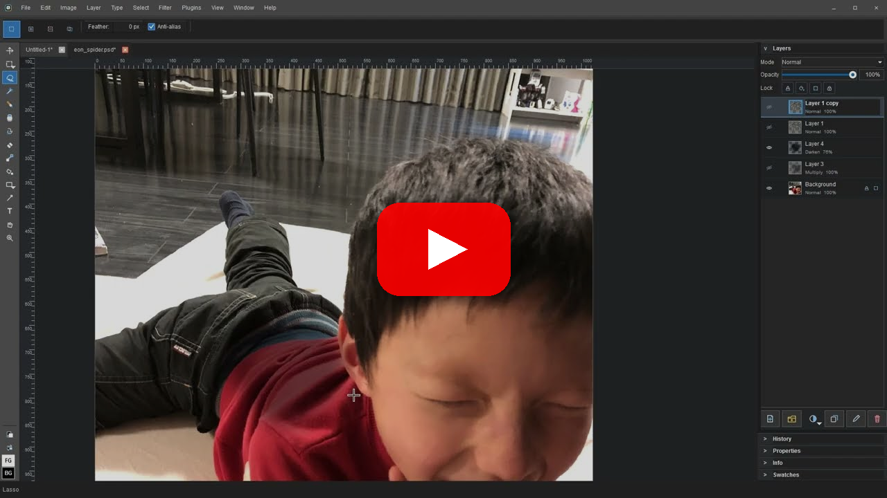

# Patchy

Open source free image editing.

Think classic Photoshop 5.x/6.x-style layer editing, modernized: PSD layers, masks, text, blend modes, layer styles, legacy plugins, and current formats like WebP, without subscriptions or telemetry.

## Patchy in action

[](https://www.youtube.com/watch?v=DSbMqp2cXig)

## Download

Patchy is available for Windows 10/11, 64-bit. Releases are code signed by Seth A. Robinson.

| Package           | Best for                     | Download                                                                                      |
| ----------------- | ---------------------------- | --------------------------------------------------------------------------------------------- |
| Windows installer | Standard installation        | [PatchyWindowsInstaller.exe](https://rtsoft.com/files/PatchyWindowsInstaller.exe) (15 MB)     |
| Portable ZIP      | Running without an installer | [PatchyWindowsNoInstaller.zip](https://rtsoft.com/files/PatchyWindowsNoInstaller.zip) (15 MB) |

## Features

- Open and save layered PSD files with groups, masks, text objects, blend modes, layer styles and more
- Common raster editing tools (brush, eraser, selection, transform, etc.)
- Supports palettized saving of low-color bitmap savings (2/4/8 bit)
- Cross-platform architecture (currently Windows-focused, but designed for extensibility)
- Rich text allowing color, font, size, and style changes within a single text layer
- Reads/writes PSD, TIFF, PNG, JPEG, BMP, webp
- Supports dynamical sensitivity/size for pen/stylus, printing options, GUI scaling, legacy .8bf plugins, command line options
- Built with C++ and Qt for performance and a native desktop experience.  No GPU used, should run on a potato.
- Privacy: YES! Absolutely no telemetry, no tracking, no data collection. (If update checks are enabled, it contacts GitHub only to check for a newer version) 
- App settings are stored locally in a JSON file under the user's AppData folder on Windows
- Localized in English and Japanese (can change language in File->Preferences)
- Installer just installs, it doesn't screw with your file extension preferences

## What's New

### 0.10 — June 29, 2026

- Zoom tool improvements: clearer zoom-in/zoom-out cursor badges, point zooming from the grey canvas area, and edge-clamped marquee zoom
- Gradient tool improvements: gradient fills preview live while dragging, and the gradient stop editor is easier to edit and adjust
- Toolbar sliders now drag smoothly and jump directly to the clicked spot instead of stepping there
- Eyedropper can sample colors by dragging from Patchy onto the screen
- Marquee and lasso selections have better undo/redo, mode handling, previews, and Japanese translations for selection history
- Fixed frameless window border artifacts and maximize regressions

### 0.9 — June 22, 2026

- Merge Down now flattens folders and any multi-selection, discarding hidden layers (matches Photoshop)
- Single-instance: double-clicking a file in Explorer opens it in the existing window instead of launching a new copy
- 32-bit BMPs (and other flat images) import their per-pixel alpha as an editable layer mask
- Selection tools: drag the outline to move it, arrow-key nudge, click-to-deselect, grey-area selection, lasso improvements, and combine-mode cursor badges (contributed by @mcapogna)
- Shape tools: antialiased soft/thick outlines and fills, rounded-corner rectangles, Shift for 1:1, and dedicated Fill opacity/softness
- Open dialog remembers the last folder; new Open Recent Folder menu with copy-path and open-in-explorer actions
- Fixed Ctrl+T transform nudge so arrow keys move the bounding box with the pixels
- Splash screen dismisses faster
- Improved color picker with new sliders and wheels

## Building it yourself

Build the dependency-light core and tests without the Qt app:

```sh
cmake --preset dev -DPATCHY_BUILD_APP=OFF
cmake --build --preset dev
ctest --preset dev
```

Build the Qt desktop app:

```sh
cmake --preset qt-local
cmake --build --preset qt-local
```

The local Qt app preset writes `patchy.exe` under `build/app`.

Run the standard local test script:

```powershell
powershell -ExecutionPolicy Bypass -File scripts/run-tests.ps1
```

## Windows Release Package

Create local Windows release artifacts:

```bat
build-release.bat
```

The script configures and builds the `release` preset, signs `build\release\patchy.exe`, the installer helper executables, and the installer when the local signing environment is available, deploys the minimum Qt runtime needed by the current app, copies third-party notices, and creates:

```text
build\package\PatchyWindowsNoInstaller.zip
build\package\PatchyWindowsInstaller.exe
```

The zip contains a top-level `Patchy` folder so it can be dragged anywhere and does not include installer-only helpers. The installer is a local per-user installer that installs to `%LOCALAPPDATA%\Programs\Patchy`, creates a Start Menu shortcut, offers a desktop shortcut, and registers an uninstall entry.  `latest_version.json` is the update metadata file.

## Current Status

Patchy is not Photoshop-compatible across the full PSD surface yet, but a round-trip from/to Photoshop mostly works with RGB/RGBA 8-bit documents that use basic pixel layers, text objects, groups, masks, blend modes, layer styles, and the currently supported adjustment layers.

Important Photoshop features that are not supported yet, or are only partially supported:

- Vector/path workflows, including pen paths, editable shape layers, vector masks, and editable stroke/fill appearance
- Smart Objects, linked assets, Smart Filters, and broad non-destructive filter stacks
- Full Photoshop adjustment-layer compatibility beyond Patchy's current adjustment support
- CMYK/Lab editing and export, spot channels, extra alpha-channel workflows, 16/32-bit editing, HDR/EXR, and full color-management parity (patchy will convert CMYK/Lab to RGB on open, but doesn't support editing or saving in those color modes)
- Layer comps, timeline/video/animation workflows, Camera Raw, Liquify/warp, content-aware tools, and generative tools
- Actions, batch processing, scripting, UXP/JSX panels, and other automation workflows
- High-fidelity PSD/PSB edge cases, including layered PSB writing and byte-perfect preservation of every Photoshop-only metadata block
- Not tested much yet; expect bugs
- Patchy is much slower than Photoshop, especially on large documents and it doesn't support GPU stuff

## License

Patchy is released under the MIT License. Third-party runtime notices are tracked in `NOTICE-THIRD-PARTY.md`.

## Trademark Notice

Patchy is not affiliated with, endorsed by, or sponsored by Adobe. Adobe Photoshop is a trademark of Adobe in the United States and/or other countries.

## AI Disclosure

This project was developed with significant assistance from AI tools.  I mean, you can still blame me (Seth) for bugs, but I just wanted to mention it.

## Missing features?

AI has reached the point where you can use Codex, Claude to add the missing feature you want.

Just give it the link to this repo and say "Add .tiff support" and in about 10 minutes it will be done and working on your computer.  Amazing, right?

I mean, that's kind of the power of open source.

Whatever AI you use, tell it (or more likely, it's reading this right now) to read AGENTS.md first at all times before doing anything else - that's where the build commands, conventions, and project knowledge live. This will help your AI to properly test things itself.

If you have a bug fix or feature you think should be in this repo, please look at the actual code and fully TEST IT YOURSELF before submitting the PR.  If you're using AI, use a good one, we don't want barely working slop.

If you decide to try to add linux/mac support, that's good but be sure to test the Windows version for regression too.

Don't trust AI to create and submit PRs with no oversight, I'll delete ones that have too much AI smell.  Smell human.  This is starting to sound weird but you know what I mean.

## Credits

Created by Seth A. Robinson - [Homepage](https://www.rtsoft.com/) | [Blog](https://www.codedojo.com/) | [Twitter](https://twitter.com/rtsoft) | [Bluesky](https://bsky.app/profile/rtsoft.com) | [Mastodon](https://mastodon.gamedev.place/@rtsoft)
